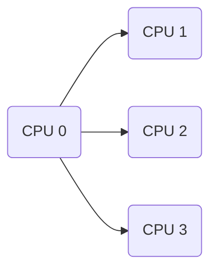
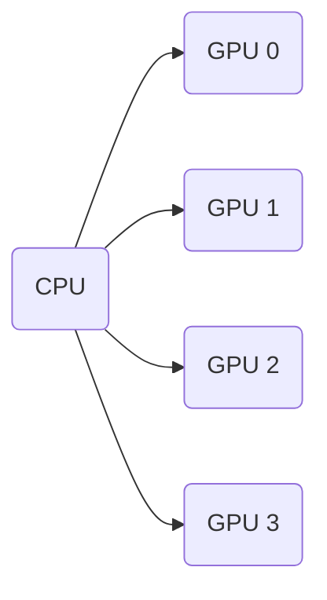

<!-- slide -->
# PT系列公选课 之<br/>软件使用 {ignore = true}
---
## <p align="right">唐本豪 <br/>物理科学学院，南开大学，天津</p> {ignore = true}
<!-- slide -->
 <B><font size = 72>https://github.com/benhaotang/pubnotebook </font></B>

<!-- slide -->
[toc]
<!-- slide -->
# 快速计算
<!-- slide -->
# 一 快速计算的原则
1. 降低计算复杂度
2. 降低内存和输出设备的访问频率
<!-- slide -->
## 1.1 计算复杂度
1. 单位：次基本运算
2. 基本运算： $+-\times\div \sin\cos\tan\ln |\Box| \cdots$
3. 函数和复杂运算：基本运算的线性和阶组合
<!-- slide -->
## 1.2 空间复杂度
1. 单位：位
2. 函数申请变量（类比指针）
<!-- slide -->
## 1.3 时间开销
1. 花费单位时间：
   1. 一次内存的读写操作
   2. 一次基本运算
2. 输出的时间开销：
   1. 多次内存的读写操作
   2. 可能：
      1. GPU等显示设备内存的读写
      2. 转译
<!-- slide -->
## 1.4 协同和集群计算

- 任务分配和独立计算
- 可减轻**大型循环体**和**大型数组索引**的单核计算压力
- 提高系统利用效率
- 缺点：
  - 单核计算效率降低
  - 很多自定义函数不能利用集群计算
<!-- slide -->
## 1.5 计算加速卡（图形显示卡）计算
- NVIDIA显卡CUDA和TF计算核心
- 显示卡集群计算

- 瓶颈
  - PCIE协议的传输效率
  - CPU的调度效率
  - VRAM访问效率
<!-- slide -->
# Matlab {ignore=true}
# 模拟 {ignore=true}
<!-- slide -->
# Matlab 
# <font color=Grey>模拟</font> {ignore=true}
<!-- slide -->
# 2.1 Matlab Pool
## 2.1.1 使用方法
<p align="left">版本Matlab<2016</p>
```matlab
matlabpool open;
parfor
    ...
end
matlabpool close;
```
<p align="left">版本Matlab>2016</p>
```matlab
pool open;
parfor
    ...
end
pool close;
```
<!-- slide -->

<!-- slide -->
## 2.1.2 原理
把循环体中接下来要进入循环的内容分配和计算
## 2.1.3 注意点
1. 如果单个循环中计算压力不大，可能会使计算效率降低
2. `parfor`不能嵌套
$\Rightarrow$
1. 多层循环在最外层利用分流计算
2. 减少函数的自身反复调用造成的嵌套
<!-- slide -->
# 2.2 代码减负
1. 重复利用已经生成好的变量
2. 数组预先初始化，减少动态申请空间的压力
   ```matlab
   x=zeros(500,1)
   ```
3. 减少循环体中的局部变量（生存期前后要申请和销毁，费时间）
4. 减少函数嵌套循环
5. 减少输出
6. 利用基础运算方法代替内置函数
7. 减少符号运算
8. 能直接打就不必建立函数
9. 简化求解：
   1. 线性近似
   2. 只完成题目要求
<!-- slide -->
# 2.3 计算减负
1. 避免对很小的数字计算(代换)
2. 计算域有类似的规模(可以利用同一种变量申请)
3. 减小步长和计算精度(精细度和容错)
   $\Rightarrow$
   1. 多级计算
   2. 人工干预
4. 降低计算的自由度
<!-- slide -->
# 2.4 意义
1.更快
2.计算准确
<!-- slide -->
# <font color=Grey>Matlab</font> {ignore=true}
# 模拟
<!-- slide -->
# 3.1 模拟的简化思路
1. 降低自由度
2. 减少关联量
3. 集群计算
4. 减少变量
5. 改写内置函数
6. 简化计算
   1. 降低网格精度（动态网格划分）
   2. 减小误差
   3. 增加步长（差值计算）
7. 减少物理场
8. 分步人为干预
   1. 多体动力学和柔性模块
<!-- slide -->
# 4 可能被忽视的方法
换软件！
换软件！
换软件！
不同软件各自有自己的专长

<!-- slide -->
- 系统原因

<!-- slide -->
- 计算原因

<!-- slide -->


<!-- slide -->


<!-- slide -->
# 谢谢！ {ignore=true}

