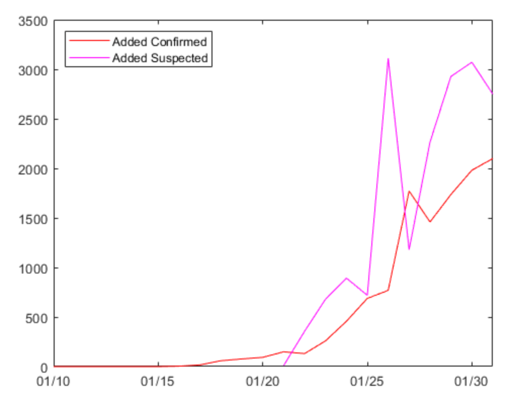

- [Update on Feb 02](#update-on-feb-02)
- [Update on Jan 31](#update-on-jan-31)

# Update on Feb 02
   
---
Feb01的数据与Jan27-Jan31做出的推断差距很大，Feb02的差距也比较大，目前还不清楚这其中差距的来由。猜测可能与Jan21武汉的万家宴等活动，加上春节前出行造成确诊人数较其他数据爬升较快，当然也有可能是新医院和更多的核酸试剂投入使用。需要密切观察这几天的数据。    

问题如下：   

受到Feb01的数据影响，导致算法负解，且比率超过100%，我将会利用之后几天的数据来评估是否是Feb01开始后的新情况，还是Feb01是一个比较大的离群点。**预计在后天(Feb04)做鲁棒性检测**来确认。   

   
---
    
# Update on Jan 31
     
---
说一下今天的分析结果吧   
1. 图一是目前的增长情况

2. 如果你第一天被认为是疑似患者，你第二天被确诊的可能性为69.59%，残差经过Chi^2检验满足正态分布，图3为残差的直方图   
   
   
3. 一个密切观察者平均7天被解除观察（请求解释？可能是由于本病毒是一个轻尾分布，也说可能是因为由于位置的数据统计方式导致此处的计数与我想象不符）   

4. 一个确诊的人基本拥有10个左右的密切接触者
   
5. 密切接触者转化为疑似或者确诊的概率为4.26%，残差也经过Chi^2检验满足态分布。   
   
   
我会把所有Matlab代码和数据延时更新在我的公开笔记本[pubnotebook/新型肺炎 at master · benhaotang/pubnotebook · GitHub](https://github.com/benhaotang/pubnotebook/tree/master/%E6%96%B0%E5%9E%8B%E8%82%BA%E7%82%8E)中的新型病毒文件夹里，大家可以查看    

---